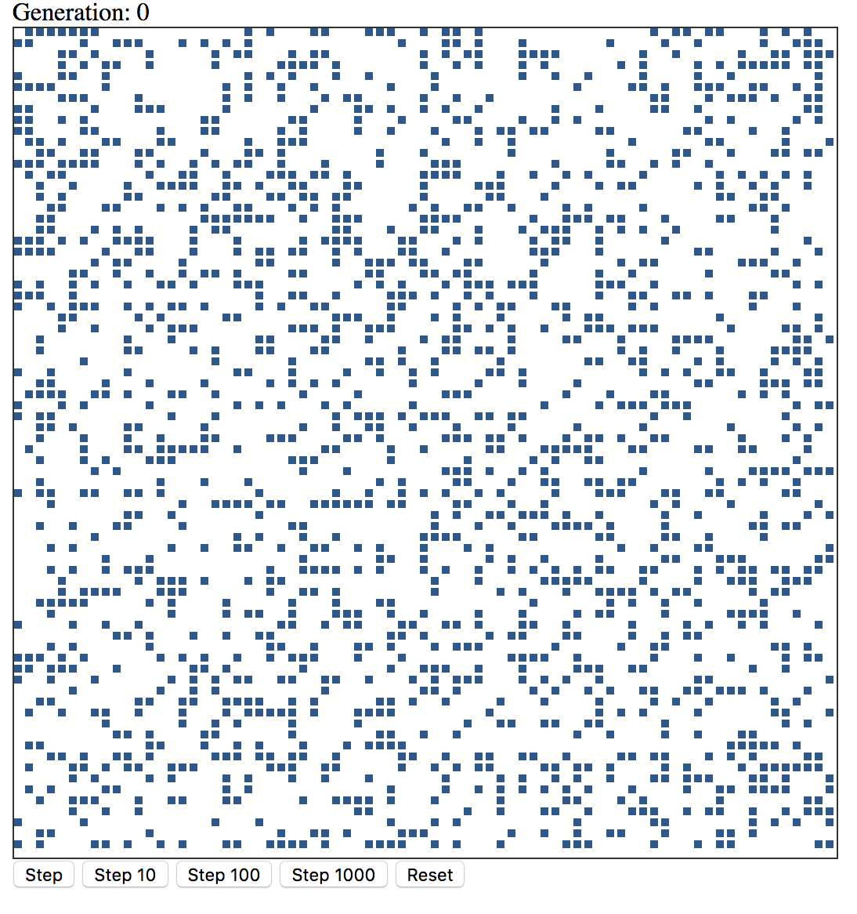

# Conway's Game of Life



Conway's Game of Life implemented in JavaScript and rendered on a canvas element.

## Running the application
This uses .net core 3.0 as a web server so you'll need to have that installed if you don't already.
Just clone the repo and then run the following from the command line/terminal.
```shell
dotnet restore
dotnet run
```
The webserver will be started and running on port 5000 so just point your browser to http://localhost:5000/
